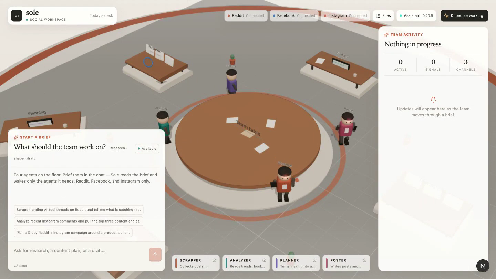

<div align="center">

# Sole HQ

**Four agents that read Reddit, Facebook and Instagram for you, tell you what is
actually happening, and write the posts.**

You type one sentence. You get a spreadsheet of every thread they found, a report of
everything they did, and drafts sitting in a queue waiting for your yes.

</div>

---

## Demo

<!-- ─────────────────────────────────────────────────────────────
     GitHub only plays video served from its own asset CDN.

     TO MAKE IT PLAY INLINE ON GITHUB:
       1. Open any issue or PR comment box on this repo
       2. Drag docs/demo.mp4 into it — GitHub uploads it and returns
          a URL like https://github.com/<user>/<repo>/assets/<id>/<f>.mp4
       3. Paste that URL on its own line just below this comment
       4. Close the comment box without submitting

     Until then the poster frame below links to the file in-repo,
     which works on a clone and on GitHub's file viewer.
     ───────────────────────────────────────────────────────────── -->

[](docs/demo.mp4)

<sub><b>▶ End-to-end, recorded live.</b> A brief goes in — <code>"Only scrape Reddit
for one SaaS pricing thread."</code> Sole routes it to <b>Scrapper alone</b> and benches
the other three. The floor reacts, the activity rail fills with real tool calls, and a
spreadsheet and report land in the tray. The detail view opens on a real r/sysadmin
thread with a live permalink, score, comments, sentiment and theme, then the timeline,
then the report rendered inline.</sub>

<sub>54 seconds, recorded against a live gateway. Only the collection stretch is sped
up; everything else is real time, real data.</sub>

---

## The problem this solves

Every early-stage company runs the same unpaid job in the background.

Someone opens fifteen tabs on a Sunday. They read three subreddits, a competitor's
comment section, and a Facebook group, looking for the thing customers keep saying.
They find four good threads. They screenshot two. By Wednesday the tabs are closed, the
screenshots are in Slack somewhere, and nobody can answer *"wait, where did that number
come from?"*

The cost is not the reading. The cost is that the reading never becomes an asset. It
leaves with the person who did it. Ask the same question next month and someone starts
from fifteen tabs again.

Sole turns that job into a run with an output. One sentence in, a dated record out:
rows you can sort, sources you can click, drafts you can approve.

### What it takes off your desk

| The job | Without Sole | What Sole hands you |
|---|---|---|
| Know what your market is complaining about | Someone skims Reddit when they remember to | A sortable sheet of threads with scores, comment counts and the theme behind each |
| Find the words customers actually use | Guessing at copy from your own vocabulary | Verbatim excerpts from real threads, ready to paste into a landing page |
| Catch a competitor stumble in time to act | You hear about it a week late from a customer | Threads captured the day they blow up, sentiment already labelled |
| Understand why a trend is happening | A screenshot of a spike with no explanation | The narrative under the spike, tied to specific threads |
| Turn research into a campaign | A doc nobody opens | A dated plan built from the threads it came from |
| Write posts that do not sound like a bot | Copy that gets ignored, or three days of editing | Platform-native drafts with the tell-tale patterns stripped |
| Prove where a claim came from | "I think I saw it on Reddit?" | Every row carries a permalink and the action that produced it |
| Do this again next month | Start over | Re-run the brief, compare the two sheets |

---

## The four agents

Four jobs, one each. You do not have to use all four. Sole reads your brief and wakes
only the ones the work needs, so a data request does not drag a copywriter into it.

### 🟠 Scrapper — finds it

Goes out and collects. Threads, comments, replies, public posts, the conversation under
the conversation.

Scrapper does not hand back a vibe. It hands back rows. Each one carries the title, the
author, the community, the score, the comment count, the date, an excerpt in the
poster's own words, and a live permalink you can open and check.

**For a startup:**

- Tracks the subreddits and groups where your buyers actually complain
- Pulls the full comment tree, not just the top post, so you see the pile-on
- Follows a competitor's name across communities and catches the churn threads
- Finds the exact phrasing people use for the problem you sell against
- Builds a dated baseline you can re-run and compare

### 🟢 Analyzer — explains it

Takes what Scrapper found and answers *so what*.

Reads across the rows for the pattern: which complaint keeps recurring, which hook earns
comments, where sentiment turns, what people ask for that nobody sells yet. Groups
threads into themes and ranks them by how much attention they pulled.

**For a startup:**

- Separates a one-off rant from a movement
- Names the narrative under a spike, so you can write to it
- Surfaces feature requests hiding inside complaint threads
- Tells you which angle to lead with and which to avoid
- Flags where a competitor is losing people, and why

### 🟣 Planner — sequences it

Turns the analysis into something with dates on it.

Takes the themes worth acting on and builds a campaign: what to post, where, in what
order, over how many days. Grounded in the threads it came from rather than invented
from nothing.

**For a startup:**

- Builds a launch sequence around a narrative already moving
- Decides which platform carries which message
- Sets the order, so the Reddit post seeds the Instagram one
- Keeps the campaign tied to its evidence, so you can defend it

### 🔴 Poster — writes it

Writes the copy. Text only, by design. No image prompts, no moodboards, no "visual
direction". One job: words that sound like a person wrote them.

Poster writes native to each platform, runs a strip pass over its own output, and puts
the result in a queue. **It does not publish. Publishing needs you to say so.**

**For a startup:**

- Writes a Reddit post where the title carries the point and the body talks like a
  person in the thread
- Writes Facebook copy that stays on one beat instead of dumping a pitch
- Writes Instagram captions, hashtags only where they earn the space
- Rewrites existing copy that reads like a press release
- Queues everything for review, so nothing reaches an audience unapproved

---

## The scraping engine

### Trend scrapers

The point is not to scrape everything. It is to scrape the places your buyers argue,
and to catch the thread while it is still moving.

- **By community.** Point it at the subreddits, pages and groups where your market
  actually gathers.
- **By phrase.** Track a competitor name, a pricing term, a category label, a product
  that keeps getting recommended instead of yours.
- **By heat.** Pull on score, comment volume and recency, so a thread with 400 comments
  today outranks one with 4,000 from last year.
- **Over time.** Re-run the same brief weekly. The sheets are comparable, so a theme
  that doubles is visible.

### Reading comments, not just posts

Most of the signal is below the fold. A post says *"pricing went up."* The comments say
which plan, by how much, who already left, and what they moved to.

Sole pulls the reply tree, sorted by what the community upvoted, and keeps excerpts
verbatim. You get the sentence a customer wrote, not a summary of the sentence a
customer wrote. That is the difference between copy that lands and copy written by
someone who has never spoken to a user.

### Finding what platform users need

The most valuable thing in a complaint thread is the unmet ask.

Sole reads for the shape of demand. *"I wish it just did X."* *"I ended up building my
own."* *"Does anyone know a tool that..."* Those lines are a roadmap and a positioning
document, sitting in public.

What comes out of it:

- Feature requests, with the number of people agreeing attached
- Objections phrased the way prospects phrase them, for your sales page
- Words your market uses that your marketing does not
- Categories people compare you to that you had not considered
- The workaround people build when nobody sells the thing

### Provenance, because a spreadsheet looks authoritative

A row with a number in it gets believed, so every row is traceable.

Each captured item carries the action and sequence number that produced it. **A row
without a resolvable link never appears on the main sheet.** It goes to a separate
`Unverified` sheet. Lines that arrive malformed are quarantined in `Malformed` rather
than dropped, so the workbook cannot quietly under-report.

If a claim is on the Signals sheet, you can click through and read the source.

---

## The analytics engine

Numbers without a story are a dashboard. Sole is built to produce the story and keep the
numbers attached to it.

### What it measures

- **Volume** — how many threads, over what window
- **Attention** — score and comment count, per thread and per theme
- **Sentiment** — labelled per item, so negative clusters are visible
- **Themes** — threads grouped by the hook underneath them, ranked by total attention
- **Spread** — which platforms and communities a narrative is showing up in
- **Movement** — re-run the brief and compare

### Themes, not tag clouds

The `Themes` sheet is the part people use most. It rolls every captured item up by the
hook underneath it and ranks by weight.

From a real run, the theme attached to one r/sysadmin thread came back as *"renewal
creep plus tier gating, with auto-renew hard to turn off"*, on a post carrying 76 points
and 95 comments, sentiment negative.

That is a campaign brief. It names the mechanism, not the mood.

### Questions it answers

- Which complaint is growing, and which has already peaked
- Which hook earns comments instead of only upvotes
- Where sentiment flips from annoyed to leaving
- Which competitor gets mentioned in threads about your category
- What people ask for that nobody in the category sells
- Whether last month's theme is still live

### The run record

Every task writes a record you can return to: the brief, which agents ran and why, every
action with its inputs and timing, what was captured, and what the team concluded at the
end. Runs accumulate into a history, so research compounds instead of evaporating.

---

## Writing and sending

### Copy that reads like a person wrote it

Poster writes the draft, then strips its own output against a fixed list of patterns
that make writing read as machine-generated.

It cuts:

- **Binary contrasts** — *"It's not a tool. It's a system."* State the point once.
- **Throat-clearing** — *"Here's the thing."* *"Let me be clear."*
- **Faux-insight** — *"What nobody tells you."* *"The part everyone misses."*
- **Colon reveals** — *"The best part: it learns."*
- **Dramatic fragments** — *"That's it. That's the whole thing."*
- **Trailing -ing analysis** — *highlighting, underscoring, showcasing*
- **Puffery** — *pivotal, testament, game changer*
- **Weasel attribution** — *experts agree, studies show*, with no source named
- **Synonym cycling** — say the clear word again instead of reaching for a new one
- **Fake-profound kickers**, and *"In conclusion"* recaps
- A standing banned list: *delve, foster, leverage, utilize, facilitate, empower,
  streamline, robust, cutting-edge, tapestry, realm, beacon, multifaceted, meticulous,
  intricate, paramount, elevate, embark, supercharge, harness*

It keeps bluntness, humour, uncertainty and specific facts. It will not invent a claim,
a statistic or a quote to make a line land.

Underneath all of it is a portability test: if a sentence could move to another
company's post unchanged, it gets cut or made specific.

### Native to each platform

| Platform | How it writes |
|---|---|
| **Reddit** | Title carries the point. Body talks like a person in the thread, not a brand in a thread. No pitch dump. |
| **Facebook** | One beat. Conversational. Short. |
| **Instagram** | Caption only. Hashtags only where they earn the space. |

### Queue, then approve

Drafts go to a queue. Nothing goes out until you say so in plain words. The report
stamps queued work **QUEUED — NOT PUBLISHED**, so a document can never be mistaken for
evidence that something shipped.

That matters when the thing being posted was written from a competitor's angry comment
section.

---

## Campaigns from narratives

The sequence that makes Sole worth running end to end:

1. **Scrapper** finds that a competitor quietly raised prices and the renewal threads
   are stacking up.
2. **Analyzer** names it: renewal shock on long-tenured accounts, negative, spreading
   across two communities, strongest in the comments rather than the posts.
3. **Planner** builds three days around it. Where to show up, in what order, what the
   Reddit post has to do before the Instagram one will land.
4. **Poster** writes each piece in the platform's own voice and queues it.

You approve or you do not. The whole chain sits in one run record, so in a month you can
open it and see which threads the campaign was built on.

### Plays you can run today

Paste any of these as a brief.

**Trend following**

```
Only scrape Reddit for threads about <category> from the last week. Just the data.
```
```
Scrape r/<subreddit> for complaints about pricing and tell me what is catching fire.
```

**Competitive intelligence**

```
Only scrape Reddit for threads mentioning <competitor>. Just the data, nothing else.
```
```
Analyze the data you already collected and give me the themes.
```

**GTM and positioning**

```
Analyze recent Instagram comments on <account> and pull the top three content angles.
```
```
Scrape Reddit for people asking for a tool that does <thing>, then analyze what they
actually want.
```

**Sales enablement**

```
Only scrape Reddit for objections people raise about <category>. Just the data.
```

**Campaign**

```
Plan a 3-day Reddit and Instagram campaign around <narrative>.
```
```
Draft Facebook and Instagram posts from today's Reddit trends. Queue only — do not
publish.
```

---

## Who gets value, and how

**Founders.** Answer *"what is our market angry about this week"* in one sentence, with
receipts. Walk into a board meeting with a sheet instead of a hunch.

**GTM and marketing.** Positioning built from words customers already use. Campaign
narratives that exist in public before you spend on them. Copy that does not read as
generated.

**Sales.** Objections in the prospect's phrasing, before the call. Competitor churn
threads that show where the deal is loose. Proof you can paste into a follow-up.

**Product.** Feature requests with the number of people agreeing attached. The
workaround people build when nobody sells the thing. The gap between what you shipped
and what they wanted.

**Community and content.** What the room is talking about, and the hook that earned the
comments rather than the one that earned the scroll.

---

## What you get back from every run

### The spreadsheet

A workbook of everything captured, six sheets deep.

| Sheet | What is in it |
|---|---|
| **Signals** | One row per verified item: platform, community, title, author, score, comments, date, sentiment, theme, verbatim excerpt, live link, provenance |
| **Themes** | Every item rolled up by hook, ranked by attention, with platform spread |
| **Tools** | Every action taken, in order, with inputs and timing |
| **Unverified** | Items with no resolvable link, held separately |
| **Malformed** | Anything that arrived unreadable, kept rather than dropped |
| **Run** | The brief, which agents ran, why, timings, totals |

Frozen headers, filters on, links live. It opens in Excel, Numbers and Sheets.

### The report

A dated document of what happened: the brief, who worked it and who sat it out, a
timestamped timeline of every action with its inputs, the items captured, and what the
team concluded. Draft copy is stamped with its queue state.

Useful for handing research to someone who was not in the room, and for answering
*"where did this come from"* three weeks later.

### In the app

You do not have to download anything to read it. Every run opens in the app with the
full dataset as a filterable table, the timeline, the report rendered inline, and the
raw output. Runs stack into a searchable history.

---

## Getting started

### Before you begin

1. **Node.js 20 or newer.** Check with `node -v`. If it is missing, install it from
   [nodejs.org](https://nodejs.org).
2. **The gateway running.** Sole talks to a local agent gateway that holds your accounts
   and does the actual work. It must be up before Sole is useful.
3. **A current browser.** The floor is 3D.

### Install

```bash
git clone <your-repo-url> Sole
cd Sole
npm install
```

### Start the gateway

```bash
hermes -p social-army gateway start
```

Leave it running. Sole connects to it on every brief.

### Start Sole

```bash
npm run dev
```

Open <http://localhost:3000>.

You should see the floor with four agents at the table, and the three platform pills in
the top bar reading **Connected**. If they read **Offline**, the gateway is not up or
not reachable. Start it and the pills flip on their own within a few seconds.

### Your first brief

Start narrow. Narrow briefs finish in seconds; broad ones can run for several minutes of
real collection work.

Type this into the chat box and send it:

```
Only scrape Reddit for one thread about SaaS pricing complaints. Just the data.
```

Watch what happens:

1. The top bar says **"Only Scrapper is needed for this brief."**
2. Scrapper lights up. The other three dim and read **"Not on this brief."**
3. The activity rail fills as it works.
4. A **Files from this task** panel appears with a spreadsheet and a report.
5. Click **Open detailed view**.

You are now looking at a real thread, with a link you can click and check.

### Reading the results

- **Signals** — the data. Filter it, sort it, click a link.
- **Timeline** — every action taken, in order.
- **Report** — the document version, rendered inline.
- **Transcript** — what the team said.

**Files** in the top bar takes you to every run you have done.

### Widening it

Once the first brief works:

```
Scrape Reddit for pricing complaints about <your category> this week, then analyze
the themes.
```

That wakes two agents. Add *"and plan a 3-day campaign"* and a third joins. Add *"and
draft the posts, queue only"* and all four run.

To scope back down, name one job: *"only scrape"*, *"just analyze the data you already
have"*, *"write a caption for this"*.

### Settings

Optional. Create `.env.local` only if the defaults do not fit:

```
HERMES_API_BASE=http://127.0.0.1:8642
HERMES_API_KEY=
HERMES_SESSION_ID=sole-hq
SOLE_RUNS_DIR=~/.sole/runs
```

Your key is read on the server and never reaches the browser.

---

## How briefs get routed

Sole reads the brief before any work starts and wakes only what is needed.

| What you type | Who runs |
|---|---|
| `Only scrape r/SaaS for pricing complaints` | Scrapper |
| `I need a sheet of competitor mentions on Facebook` | Scrapper |
| `Analyze the data you already collected` | Analyzer |
| `Plan a 3-day launch campaign` | Planner |
| `Write a caption for the launch` | Poster |
| `Draft posts from today's Reddit trends` | All four, in order |
| anything naming no job | All four |

Name one job and it runs alone. Name several and everything between them runs too, so
*"draft posts from today's trends"* still collects and analyzes first. Say *"already"*
or *"existing"* and it skips collecting and works from what it has.

The reason is printed in the top bar and saved into the run, so you can always see why a
particular agent worked.

---

## Control and safety

- **Nothing publishes on its own.** Drafts queue. Publishing takes an explicit yes from
  you, in the chat.
- **One brief at a time.** A second brief while one is running is turned away with a
  message rather than allowed to corrupt both.
- **Every claim is traceable.** Rows carry the action that produced them.
- **Nothing untraceable gets promoted.** A row with no link never sits on the main sheet.
- **Your credentials stay on your machine.** Keys are read server-side and never sent to
  the browser. Records are cleaned before they are written to disk.
- **Partial work survives.** An interrupted run still leaves everything collected up to
  that point.

---

## Scope, honestly

Worth knowing before you rely on it.

- **It works Reddit, Facebook and Instagram.** Not X, not LinkedIn, not TikTok. That is
  deliberate, and the agents will not pretend otherwise.
- **Row quality tracks the run.** Collection depends on the agent following the capture
  format. A run that summarises instead of listing produces a thin sheet. The
  `Unverified` and `Malformed` sheets exist so you can see when that happened, rather
  than being handed a clean-looking number.
- **Broad briefs are slow.** A wide sweep is minutes of real collection. Narrow briefs
  finish in seconds. Start narrow.
- **Runs accumulate.** Records build up on disk and are not cleaned up for you.
- **Reading is public only.** It reads what anyone could read.

---

## Where things live

```
Files (top bar)      every run you have done
/runs                the same list, as a page
/runs/<id>           one run: data, timeline, report, transcript
~/.sole/runs/        the records on disk, including the spreadsheet and report
```

---

<div align="center">
<sub>Brief the team. Read the sheet. Approve the drafts.</sub>
</div>
